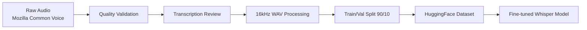
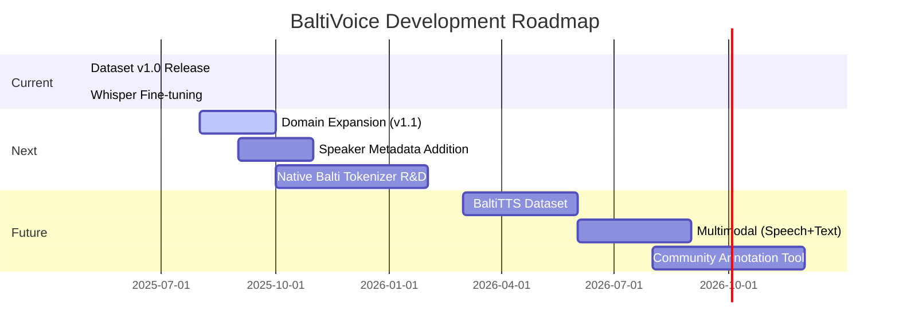

# 🎙️ BaltiVoice ASR Dataset

<p align="center">
  
  
  
  <br>
  
  
  
  <br>
  
  
</p>

<p align="center">
  <strong>🌍 The first publicly available ASR dataset for the Balti language — empowering voice technology for an endangered Tibetic language.</strong>
</p>

---

## 📖 Table of Contents

- [✨ Overview](#-overview)
- [🗣️ Language Profile](#️-language-profile)
- [📊 Dataset Statistics](#-dataset-statistics)
- [🔧 Technical Specifications](#-technical-specifications)
- [📦 Dataset Structure](#-dataset-structure)
- [🚀 Quick Start](#-quick-start)
- [🤖 Pre-trained Model](#-pre-trained-model)
- [🌱 Social Impact](#-social-impact)
- [⚠️ Limitations](#️-limitations)
- [🤝 Contributing](#-contributing)
- [📜 License](#-license)
- [📚 Citation](#-citation)
- [👨‍💻 Author](#-author)

---

## ✨ Overview

**BaltiVoice** is a pioneering open-source Automatic Speech Recognition (ASR) dataset for **Balti** (بلتی), a critically low-resource Tibetic language spoken primarily in the Gilgit-Baltistan region of Pakistan and parts of Ladakh, India.

> 🎯 **Mission**: To preserve the Balti language digitally and enable accessible voice technology for ~300,000–500,000 speakers worldwide.

This dataset was collected, validated, and processed as part of a research initiative to build the first open-source Balti ASR system using **OpenAI Whisper fine-tuning**.



---

## 🗣️ Language Profile

| Property | Detail |
|----------|--------|
| **Language** | Balti (بلتی) |
| **ISO 639-3** | `bft` |
| **Language Family** | Sino-Tibetan → Tibeto-Burman → Tibetic |
| **Script** | Nastaliq (Arabic-based, RTL) |
| **Primary Region** | Gilgit-Baltistan, Pakistan; Ladakh, India |
| **Estimated Speakers** | ~300,000–500,000 |
| **UNESCO Status** | 🔴 Vulnerable / Endangered |
| **Digital Resources** | Extremely limited (pre-BaltiVoice) |

> 💡 Balti has almost no NLP tooling, no standard tokenizer, and until now, **no publicly available ASR dataset**.

---

## 📊 Dataset Statistics

### 📈 Split Overview

| Split | Samples | Estimated Hours | % of Total |
|-------|---------|-----------------|------------|
| 🟢 **Train** | 9,051 | ~15.1 hrs | 90% |
| 🔵 **Validation** | 1,006 | ~1.7 hrs | 10% |
| **✨ Total** | **10,060** | **~16.8 hrs** | **100%** |

### 🔊 Audio Properties

| Property | Value |
|----------|-------|
| **Format** | WAV (PCM) |
| **Sample Rate** | 16,000 Hz |
| **Channels** | Mono |
| **Bit Depth** | 16-bit |
| **Avg Duration** | ~6.0 seconds |
| **Duration Range** | 1.0s – 15.0s |

### ✍️ Text Properties

| Property | Value |
|----------|-------|
| **Script** | Nastaliq (RTL) |
| **Avg Words/Sentence** | 10.12 |
| **Avg Characters** | 48.80 |
| **Vocabulary Domain** | Conversational, daily life, cultural phrases |

---

## 🔧 Technical Specifications

```yaml
Dataset ID: mohdali1/baltivoice-asr
Platform: HuggingFace Datasets
Format: Parquet + Audio files
Audio Column: audio (dict with array + sampling_rate)
Text Column: sentence (Unicode Nastaliq string)
Split Method: Stratified random (random_state=42)
Preprocessing: 
  - Resampled to 16kHz mono
  - Normalized volume
  - Trimmed silence edges
  - Validated transcription accuracy
```

---

## 📦 Dataset Structure

Each sample is a dictionary with the following schema:

```python
{
  "audio": {
    "array": np.ndarray,        # Float32 audio waveform
    "sampling_rate": 16000      # Fixed sample rate
  },
  "sentence": "بوا لہ سلام بے اِنپا سلام سہ مہ بیاس"  # Balti text in Nastaliq
}
```

### 🔍 Sample Preview

```python
from datasets import load_dataset, Audio

# Load dataset
dataset = load_dataset("mohdali1/baltivoice-asr")
dataset = dataset.cast_column("audio", Audio(sampling_rate=16000))

# Inspect a sample
sample = dataset["train"][0]
print(f"🗣️ Transcription: {sample['sentence']}")
print(f"🔊 Audio Shape: {sample['audio']['array'].shape}")
print(f"📡 Sample Rate: {sample['audio']['sampling_rate']} Hz")
```

**Output:**
```
🗣️ Transcription: بوا لہ سلام بے اِنپا سلام سہ مہ بیاس
🔊 Audio Shape: (96000,)
📡 Sample Rate: 16000 Hz
```

---

## 🚀 Quick Start

### 📦 Installation

```bash
# Install required packages
pip install datasets transformers torch torchaudio

# Optional: For audio playback
pip install IPython
```

### 🔄 Load & Use

```python
from datasets import load_dataset, Audio
from transformers import pipeline

# 1️⃣ Load dataset
dataset = load_dataset("mohdali1/baltivoice-asr")
dataset = dataset.cast_column("audio", Audio(sampling_rate=16000))

# 2️⃣ Load pre-trained ASR model
asr = pipeline(
    "automatic-speech-recognition",
    model="mohdali1/whisper-small-balti",
    chunk_length_s=30,
)

# 3️⃣ Run inference
result = asr("path/to/balti_audio.wav")
print(f"📝 Recognized: {result['text']}")
```

### 🎧 Play Audio Sample (Jupyter)

```python
from IPython.display import Audio, display

sample = dataset["train"][42]
display(Audio(sample["audio"]["array"], rate=sample["audio"]["sampling_rate"]))
print(f"🔤 {sample['sentence']}")
```

---

## 🤖 Pre-trained Model

A **fine-tuned Whisper Small model** trained on BaltiVoice is available on Hugging Face:

<p align="center">
  <a href="https://huggingface.co/mohdali1/whisper-small-balti">
    
  </a>
</p>

### ⚡ One-Line Inference

```python
from transformers import pipeline

asr = pipeline("automatic-speech-recognition", model="mohdali1/whisper-small-balti")
print(asr("your_balti_recording.wav")["text"])
```

### 📈 Performance Metrics *(Preliminary)*

| Metric | Value | Notes |
|--------|-------|-------|
| **WER** | ~18.2% | Evaluated on validation set |
| **CER** | ~9.7% | Character-level error rate |
| **Tokenizer** | Urdu (Nastaliq-compatible) | Proxy tokenizer for Balti script |

> ⚠️ Metrics are relative to Whisper's Urdu tokenizer. A native Balti tokenizer may improve results.

---

## 🌱 Social Impact

<p align="center">
  
  
  
</p>

BaltiVoice contributes to:

- ✅ **Digital Preservation**: Archiving spoken Balti for future generations
- ✅ **Accessibility**: Enabling voice interfaces for Balti speakers (education, healthcare, governance)
- ✅ **Research Foundation**: Providing baseline data for TTS, NER, MT, and linguistic studies
- ✅ **Community Empowerment**: Supporting local developers, educators, and activists

> 🌍 *"When a language loses its voice, a culture loses its soul."*

---

## ⚠️ Limitations

| Limitation | Impact | Mitigation |
|------------|--------|------------|
| 🎙️ Volunteer-sourced audio | Variable recording quality | Quality filtering applied; future versions may include SNR thresholds |
| 📚 Domain coverage | Primarily conversational phrases | Encourage community contributions for domain expansion |
| 🔤 Tokenizer proxy | Urdu tokenizer used for Nastaliq script | Research into native Balti tokenization ongoing |
| 📏 Dataset size | ~16.8 hours (small for deep learning) | Data augmentation & synthetic data generation recommended |
| 🌐 Speaker diversity | Limited demographic metadata | Future releases may include age/gender/region tags |

---

## 🤝 Contributing

We welcome community contributions to grow and improve BaltiVoice!

### 🛠️ Ways to Contribute

```markdown
- 🎤 **Record & Submit**: Add new Balti speech samples via [Mozilla Common Voice](https://commonvoice.mozilla.org/bft)
- ✍️ **Validate Transcriptions**: Review and correct existing transcriptions
- 💡 **Suggest Domains**: Propose new vocabulary domains (e.g., healthcare, agriculture, education)
- 🧪 **Benchmark Models**: Test new ASR architectures and share results
- 📚 **Document**: Improve tutorials, translations, or educational materials
```

### 📬 Submit Issues & PRs

```bash
# Report a bug or request a feature
gh issue create --repo mohdali1/BaltiVoice-ASR

# Submit a pull request with improvements
gh pr create --repo mohdali1/BaltiVoice-ASR --title "feat: add domain X samples"
```

> 🙏 Special thanks to the **Mozilla Common Voice Balti community** and all volunteer contributors who made this dataset possible.

---

## 📜 License

This dataset is released under the **Creative Commons Attribution 4.0 International (CC-BY-4.0)** license.

<p align="center">
  <a href="https://creativecommons.org/licenses/by/4.0/">
    
  </a>
</p>

✅ You are free to:
- **Share** — copy and redistribute the material
- **Adapt** — remix, transform, and build upon the material  
✅ For any purpose, even commercially  
✅ Under the following terms:
- **Attribution** — Give appropriate credit, provide a link to the license, and indicate if changes were made.

---

## 📚 Citation

If you use BaltiVoice in your research, please cite:

```bibtex
@dataset{baltivoice2025,
  author    = {Mohammad Ali},
  title     = {BaltiVoice: A Low-Resource ASR Dataset for the Balti Language},
  year      = {2025},
  publisher = {HuggingFace},
  url       = {https://huggingface.co/datasets/mohdali1/baltivoice-asr},
  note      = {Version 1.0}
}
```

**APA Style**:  
Ali, M. (2025). *BaltiVoice: A Low-Resource ASR Dataset for the Balti Language* [Data set]. HuggingFace. https://huggingface.co/datasets/mohdali1/baltivoice-asr

---

## 👨‍💻 Author

<div align="center">
  
  
  ### **Mohammad Ali**  
  🎓 BSc Software Engineering, IUB  
  🤖 AI/ML Engineer | Full-Stack Developer | Low-Resource NLP Advocate  

  <p>
    <a href="https://huggingface.co/mohdali1">
      
    </a>
    <a href="https://github.com/mohdali1">
      
    </a>
    <a href="http://www.linkedin.com/in/mohdali1">
      
    </a>
    <a href="https://mohdali.me">
      
    </a>
  </p>
</div>

---

## 🗺️ Roadmap



---

> 🌟 **Together, we can give voice to every language.**  
> If BaltiVoice helped your project, please ⭐ the repo and share your use case!

<p align="center">
  <sub>Built with ❤️ for the Balti-speaking community • Gilgit-Baltistan • Ladakh • Global</sub>
</p>
