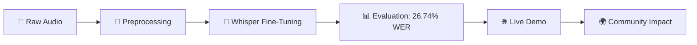
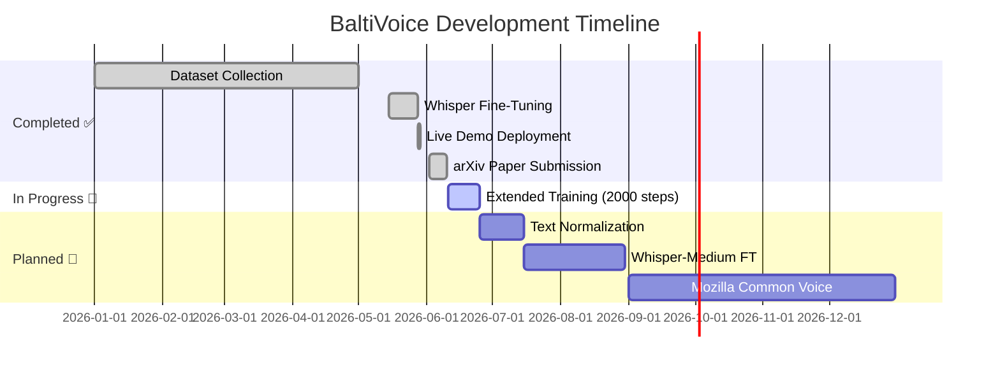

<div align="center">

# 🎙️ BaltiVoice ASR
### First AI-Powered Automatic Speech Recognition for the Balti Language

[](https://huggingface.co/datasets/mohdali1/baltivoice-asr)
[](https://huggingface.co/mohdali1/whisper-small-balti)
[](https://huggingface.co/spaces/mohdali1/baltivoice-demo)
[](https://arxiv.org/abs/2606.03504)
[](LICENSE)
[]()
[]()
[]()

<br>


### *Speak Balti. Get Transcription. Preserve Culture.*

</div>

---

## 🌟 Why BaltiVoice? The Mission

### 🗣️ The Language: Balti (بلتی)
Balti is a Tibetic language spoken by approximately 400,000 to 450,000 people in Gilgit-Baltistan, Pakistan, and Ladakh, India. With roots in Classical Tibetan, it carries centuries of oral history, poetry, and cultural identity.

| Feature | Detail |
| --- | --- |
| **Script** | Primarily Perso-Arabic (Nastaliq); historically Tibetan. |
| **Status** | 🔴 **Critically Low-Resource**: No standard digital tools, no ASR models, limited NLP datasets. |
| **Risk** | Without digital representation, the language risks fading from the modern technological landscape. |

### 💔 The Problem: A Digital Silence
Despite its rich heritage, Balti suffers from "Digital Neglect."
- ❌ **Zero Public ASR**: Until now, there was no open-source speech-to-text model for Balti.
- ❌ **No Standard Data**: Researchers had no validated audio-text pairs to build upon.
- ❌ **Accessibility Barrier**: Native speakers could not use voice assistants, transcription tools, or educational apps in their mother tongue.

> *"When a language lacks digital tools, it becomes invisible to the future. I built BaltiVoice to ensure Balti has a seat at the AI table."*

### 🚀 Why I Built This Model
As an AI/ML Engineer, I wanted to bridge the gap between cutting-edge technology and underserved communities. This project is about more than fine-tuning Whisper—it’s about preservation through code.
- **Preserve Oral History**: By digitizing speech, we create a permanent archive of Balti pronunciation and dialects.
- **Prove Low-Resource Viability**: Demonstrating that high-quality ASR is possible with just ~16 hours of data using transfer learning.
- **Empower Future Builders**: This dataset and model serve as a foundation for:
  - 🎓 **Education**: Tools to teach Balti literacy.
  - 🏥 **Healthcare**: Voice-to-text for medical records in rural areas.
  - 📻 **Media**: Transcribing local radio and folk stories.

---

## 🏆 What We Built

<div align="center">



</div>

### ✨ Key Deliverables

| 📦 Component | 📝 Description | 🔗 Access |
| --- | --- | --- |
| **Dataset** | 10,060 validated Balti audio clips (~16.8h) | [](https://huggingface.co/datasets/mohdali1/baltivoice-asr) |
| **Model** | Whisper-small fine-tuned for Balti ASR | [](https://huggingface.co/mohdali1/whisper-small-balti) |
| **Demo** | Real-time transcription via web interface | [](https://huggingface.co/spaces/mohdali1/baltivoice-demo) |
| **Code** | Reproducible training & evaluation pipeline | [](https://github.com/mohdali-dev/BaltiVoice-ASR) |
| **Paper** | Formal research publication on arXiv | [](https://arxiv.org/abs/2606.03504) |

---

## 📈 Results That Matter

<div align="center">

### Word Error Rate (WER) & Character Error Rate (CER) — Lower is Better 🎯

| Model | WER (%) | CER (%) | Dataset | Steps |
| --- | --- | --- | --- | --- |
| Whisper-small (zero-shot) | 159.19% | 152.52% | BaltiVoice | — |
| Whisper-base (fine-tuned) | 44.54% | 15.61% | BaltiVoice | 1000 |
| **Whisper-small (fine-tuned)** | **26.74%** ✅ | **8.67%** ✅ | BaltiVoice | 1000 |

> Zero-shot WER above 100% indicates hallucination — the model generates words not present in the reference. Fine-tuning on 16.8 hours of Balti speech reduces this to an impressive **26.74% WER** and **8.67% CER** on a 538-utterance speaker-disjoint validation set.

<br>

### Training Progress 📉

| Step | Training Loss | Validation Loss | Raw WER (%) |
| --- | --- | --- | --- |
| 250 | 0.7905 | 0.4037 | 40.19% |
| 500 | 0.5968 | 0.3208 | 33.37% |
| 750 | 0.4542 | 0.2963 | 31.37% |
| 1000 | 0.4652 | 0.2830 | 30.07%* |

> *\*Raw WER at step 1000. Final normalized evaluation (punctuation removed) on the speaker-disjoint held-out set yields **26.74% WER**, confirming the model generalizes well to unseen speakers.*

🎉 **~130 point improvement from zero-shot** — proving effective transfer learning for low-resource languages.

</div>

---

## 🚀 Get Started in 60 Seconds

### Option 1: Try the Live Demo (No Code)
<div align="center">

[](https://huggingface.co/spaces/mohdali1/baltivoice-demo)

</div>

### Option 2: Run Locally (Python)

```bash
# 1️⃣ Clone the repo
git clone https://github.com/mohdali-dev/BaltiVoice-ASR.git
cd BaltiVoice-ASR

# 2️⃣ Install dependencies
pip install -r requirements.txt

# 3️⃣ Transcribe audio in 3 lines of code
```

```python
from transformers import pipeline

asr = pipeline(
    "automatic-speech-recognition",
    model="mohdali1/whisper-small-balti",
    generate_kwargs={"language": "urdu", "task": "transcribe"}
)

result = asr("your_balti_audio.wav")
print(f"📝 Transcription: {result['text']}")
# Output: بوا لہ سلام بے اِنپا سلام سہ مہ بیاس
```

### Option 3: Use the Dataset for Research

```python
from datasets import load_dataset

dataset = load_dataset("mohdali1/baltivoice-asr")
print(dataset)
# DatasetDict({
#     train: Dataset({features: ['audio', 'sentence'], num_rows: 9519})
#     validation: Dataset({features: ['audio', 'sentence'], num_rows: 538})
# })
```

---

## 🗂️ Project Structure

```text
BaltiVoice-ASR/
├── 📁 src/
│   ├── 🐍 data_audit.py          # Dataset analysis & validation
│   ├── 🐍 preprocess.py          # Audio preprocessing pipeline  
│   ├── 🐍 train.py               # Whisper fine-tuning script
│   └── 🐍 evaluate.py            # WER/CER evaluation & metrics
├── 📁 notebooks/
│   └── 📓 BaltiVoice.ipynb       # Full Colab-ready training notebook
├── 📁 scripts/
│   └── 🐚 run_training.sh        # One-command training launcher
├── 🎨 app.py                     # Gradio demo (HF Spaces)
├── 📋 requirements.txt           # Python dependencies
├── 📄 LICENSE                    # MIT License
└── ✨ README.md                  # You are here!
```

---

## ⚙️ Training Configuration

<div align="center">

| Parameter | Value |
| --- | --- |
| 🧠 **Base Model** | openai/whisper-small |
| 🌐 **Language Token** | urdu (closest supported to Balti) |
| 🎯 **Task** | transcribe |
| 📚 **Learning Rate** | 1e-5 |
| 🔢 **Batch Size** | 8 (with gradient accumulation) |
| 🔄 **Max Steps** | 1000 |
| ⚡ **Precision** | fp16 (mixed precision) |
| 🖥️ **Hardware** | Google Colab T4 GPU (free tier) |
| ⏱️ **Training Time** | ~1 hour 54 minutes |

</div>

<details>
<summary>🔧 View Full Training Code</summary>

```python
from transformers import Seq2SeqTrainingArguments

training_args = Seq2SeqTrainingArguments(
    output_dir="./whisper-balti",
    per_device_train_batch_size=8,
    gradient_accumulation_steps=2,
    learning_rate=1e-5,
    warmup_steps=100,
    max_steps=1000,
    gradient_checkpointing=True,
    fp16=True,
    eval_strategy="steps",
    eval_steps=250,
    save_steps=250,
    logging_steps=25,
    load_best_model_at_end=True,
    metric_for_best_model="wer",
    push_to_hub=True,
    hub_model_id="mohdali1/whisper-small-balti",
)
```

</details>

---

## 🌐 Live Demo Features

<div align="center">

<div style="border: 1px solid #d1d5db; border-radius: 8px; overflow: hidden; box-shadow: 0 4px 6px -1px rgba(0, 0, 0, 0.1); max-width: 800px;">
 <div style="background: #f3f4f6; padding: 8px 12px; border-bottom: 1px solid #d1d5db; display: flex; gap: 6px;">
 <div style="width: 10px; height: 10px; background: #ef4444; border-radius: 50%;"></div>
 <div style="width: 10px; height: 10px; background: #f59e0b; border-radius: 50%;"></div>
 <div style="width: 10px; height: 10px; background: #10b981; border-radius: 50%;"></div>
 </div>
 
 </div>

</div>

### ✨ What You Can Do:
- 🎤 **Record Live**: Speak Balti directly into your microphone
- 📁 **Upload Audio**: Drop any WAV/MP3 file (16kHz recommended)
- ⚡ **Instant Transcription**: Get text in native Balti script immediately
- 🔄 **Try Examples**: Pre-loaded sample clips to test accuracy
- 📱 **Mobile Friendly**: Works on phone, tablet, or desktop

<div align="center">

[](https://huggingface.co/spaces/mohdali1/baltivoice-demo)

</div>

---

## 🗺️ Roadmap — What's Next?

<div align="center">



</div>

### 🎯 Upcoming Features
- ✔️ **Speaker-disjoint split**: Zero speaker overlap confirmed
- ✔️ **Zero-shot baseline**: Measured at 159.19% WER
- ✔️ **arXiv Paper**: Formal research publication [arXiv:2606.03504](https://arxiv.org/abs/2606.03504)
- [ ] **Extended Training**: Push to 2000 steps → target ~24% WER
- [ ] **Text Normalization**: Post-processing for cleaner outputs
- [ ] **Whisper-Medium**: Larger model for better accuracy
- [ ] **Romanized Support**: Handle both Nastaliq & Latin script Balti
- [ ] **Speaker Adaptation**: Better performance across accents
- [ ] **Community Contribution**: Submit to Mozilla Common Voice

---

## 🤝 How to Contribute

We welcome contributions from Balti speakers, linguists, and ML engineers!

### 🐛 Found an Issue?
```bash
# 1. Check existing issues
# 2. Create a new issue with:
#    - Audio sample (if applicable)
#    - Expected vs actual output
#    - Environment details
```

### 💡 Want to Improve the Model?
```bash
# 1. Fork the repository
# 2. Create a feature branch: git checkout -b feat/your-idea
# 3. Make your changes + add tests
# 4. Submit a PR with description
```

### 🗣️ Speak Balti? Help Us Validate!
- Listen to model outputs and flag errors
- Suggest common phrases to add to the dataset
- Help translate documentation into Balti

<div align="center">

[](https://github.com/mohdali-dev/BaltiVoice-ASR/pulls)
[](https://github.com/mohdali-dev/BaltiVoice-ASR/issues)

</div>

---

## 📚 Citation

If you use BaltiVoice in your research, please cite:

```bibtex
@misc{ali2026baltivoice,
  author    = {Muhammad Ali},
  title     = {BaltiVoice: A Speech Corpus and Fine-tuned Whisper ASR System for the Balti Language},
  year      = {2026},
  eprint    = {2606.03504},
  archivePrefix = {arXiv},
  primaryClass = {cs.CL},
  url       = {https://arxiv.org/abs/2606.03504}
}
```

---

## 📄 License

This project is licensed under the **MIT License** — feel free to use, modify, and distribute.

<div align="center">

[](LICENSE)

</div>

---

## 🙏 Acknowledgements

<div align="center">

| 🤗 HuggingFace | 🎙️ Mozilla Common Voice | 🧠 OpenAI Whisper |
|--------------|------------------------|-----------------|
| For hosting & infrastructure | For dataset format inspiration | For the base ASR model |

<br>

*Special thanks to the Balti-speaking community of Gilgit-Baltistan for cultural guidance and validation support.*

</div>

---

<div align="center">

### 🌟 Built with ❤️ for Language Preservation

[](https://huggingface.co/mohdali1)
[](https://github.com/mohdali-dev)
[](https://linkedin.com/in/mohdali1)
[](https://orcid.org/0009-0005-3272-4489)
[](https://mohdali.me)

<br>

*"Technology should serve all languages — not just the most spoken ones."*

</div>
